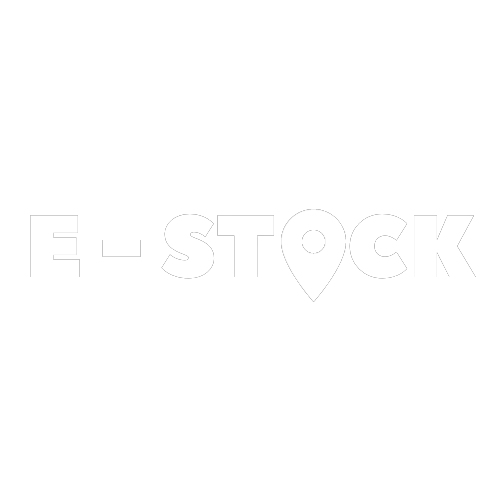
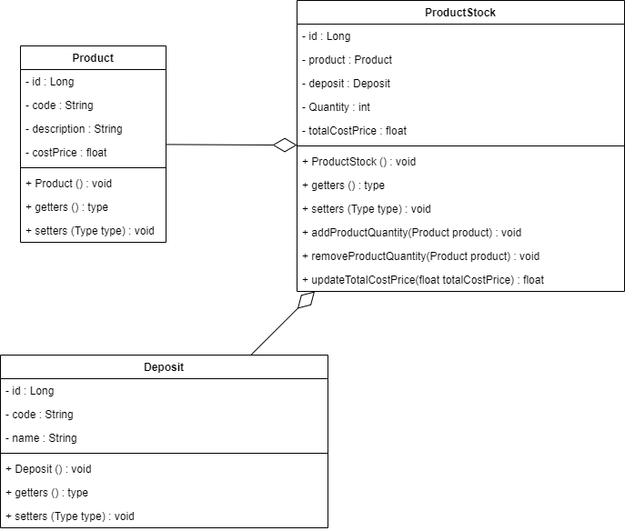

**A project developed by: Paulo Rodrigues.**

## About
A project to map your products in your deposits.

## Swagger Documentation
- Index: [Swagger UI](http://localhost:8080/swagger-ui/index.html#/)
- JSON: [API Docs (JSON)](http://localhost:8080/api-docs)
- YAML: [API Docs (YAML)](http://localhost:8080/api-docs.yaml)

## Insomnia File
- [Click to download!](docs/Insomnia_2023-10-07.json)

## Class Diagram

## Functional Requirements
- The system must allow Registering, Deleting, Updating, and Searching for Products:
  - **Attributes:**
    - Code
    - Description
    - Cost Price

- The system must allow Linking Products to the warehouse
- The system must allow Adding quantities of the product in the warehouse
- The system must allow Removing quantities of the product in the warehouse
- The system must allow Updating the total value based on the quantity in the warehouse
- The system must allow Searching for the details of products linked to the warehouse
- The system must allow Searching for the quantities of products linked to the warehouse
- The system must allow Deleting a Product Stock Record by "ProductStock id"

## Non-Functional Requirements
- Develop the Project using Spring Boot, Postgres (Migrations), and In-Memory Database (H2)
- Create Documentation using Swagger
- Achieve a minimum code coverage of 50%

## Business Rules
- It must allow a product to be linked to multiple warehouses
- It must allow a warehouse to have multiple products linked
- Whenever the quantity of a certain product reaches zero, remove the product record from the warehouse

## Coverage

